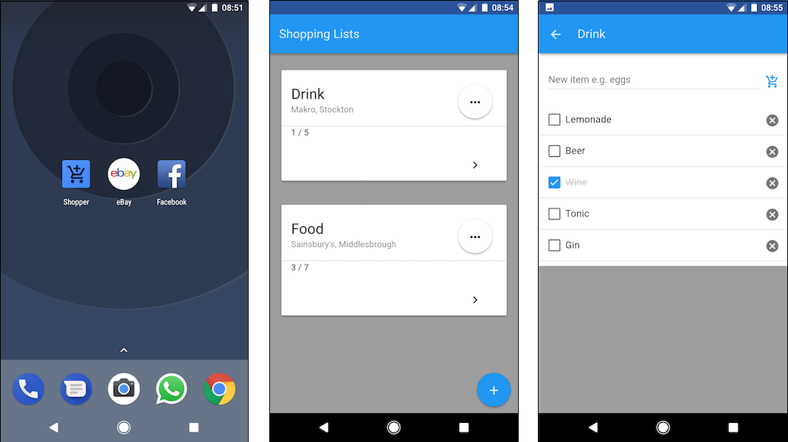

# Shopping List - with Vue.js and PouchDB

Shopping List is an Offline First demo [Progressive Web App | hybrid mobile app | native mobile app | desktop app] built using [Vue.js](https://vuejs.org/) and [PouchDB](https://pouchdb.com/). [This app is part of a series of Offline First demo apps, each built using a different stack.](https://github.com/ibm-watson-data-lab/shopping-list) 

## Quick Start

To see this app in action without installing anything, simply visit https://ibm-watson-data-lab.github.io/shopping-list-vuejs-pouchdb/ in a web browser or mobile device.

## Features

Shopping List is a simple demo app, with a limited feature set. Here is a list of features written as user stories grouped by Epic:

* Planning
  * As a \<person planning to shop for groceries\>, I want to \<create a shopping list\> so that \<I can add items to this shopping list\>.
  * As a \<person planning to shop for groceries\>, I want to \<add an item to my shopping list\> so that \<I can remember to buy that item when I am at the grocery store later\>.
  * As a \<person planning to shop for groceries\>, I want to \<remove an item from my shopping list\> so that \<I can change my mind on what to buy when I am at the grocery store later\>.
* Shopping
  * As a \<person shopping for groceries\>, I want to \<view items on my shopping list\> so that \<I can remember what items to buy\>.
  * As a \<person shopping for groceries\>, I want to \<add an item to my shopping list\> so that \<I can remember to buy that item\>.
  * As a \<person shopping for groceries\>, I want to \<remove an item from my shopping list\> so that \<I can change my mind on what to buy\>.
  * As a \<person shopping for groceries\>, I want to \<check off an item on my shopping list\> so that \<I can keep track of what items I have bought\>.
* Offline First
  * As a \<person shopping for groceries\>, I want to \<have the app installed on my device\> so that \<I can continue to utilize my shopping list when no internet connection is available\>.
  * As a \<person shopping for groceries\>, I want to \<have my shopping list stored locally on my device\> so that \<I can continue to utilize my shopping list when no internet connection is available\>.
  * As a \<person shopping for groceries\>, I want to \<sync my shopping list with the cloud\> so that \<I can manage and utilize my shopping list on multiple devices\>.
* Multi-User / Multi-Device
  * As a \<new user\>, I want to \<sign up for the app\> so that \<I can use the app\>.
  * As an \<existing user\>, I want to \<sign in to the app\> so that \<I can use the app\>.
  * As an \<existing user\>, I want to \<sign out of the app\> so that \<I can protect my privacy\>.
* Geolocation
  * As a \<person planning to shop for groceries\>, I want to \<associate a shopping list with a grocery store\> so that \<I can be notified of this shopping list when I am physically at that grocery store\>.
  * As a \<person associating a shopping list with a physical store\>, I want to \<access previously-used locations\> so that \<I can quickly find the physical store for which I am searching\>.
  * As a \<person shopping for groceries\>, I want to \<be notified of a shopping list when I am physically at the grocery store associated with that shopping list\> so that \<I can quickly find the shopping list for my current context\>.

## App Architecture

\<Information detailing the app architecture; for using this app as a reference implementation\>

## Live Demo

You can try this demo on a mobile phone by visiting https://ibm-watson-data-lab.github.io/shopping-list-vuejs-pouchdb/. It will open in a web browser. Choose "Add to home screen" and the app will installed on your phone as if it were a downloadable native app. It will appear on your home screen with an icon and the lists and items you create will be stored on your phone.

## Tutorial

This [Tutorial](tutorial.md) will show you how to build this app step-by-step.

* [Prerequisite Knowledge & Skills](tutorial.md#prerequisite-knowledge--skills)
* [Key Concepts](tutorial.md#key-concepts)
* [Initial Set Up](tutorial.md#initial-set-up)
* [Creating the Vue.js App](tutorial.md#creating-the-vuejs-app)
* [Adding Data](tutorial.md#adding-data)
* [Adding a shopping list](tutorial.md#adding-a-shopping-list)
* [Storing the new shopping list](tutorial.md#storing-the-new-shopping-list)
* [Checking items](tutorial.md#checking-items)
* [Adding a PouchDB Database](tutorial.md#adding-a-pouchdb-database)
* [Checkbox events](tutorial.md#checkbox-events)
* [Making a PWA](tutorial.md#making-a-pwa)
* Syncing Data
  * Configure a Database
     * Option 1: Apache CouchDB
     * Option 2: IBM Cloudant
     * Option 3: Cloudant Developer Edition
  * Configure Remote Database Credentials
  * Trigger Database Replication
* Adding Multi-User / Multi-Device Features with Hoodie
  * Installing Hoodie
  * Configuring Hoodie
  * Using the Hoodie Store API
  * Using Hoodie Account API
  * Testing Offline Sync
* Adding Gelocation Features
* What's next?
  * Other Features
  * Get Involved in the Offline First Community!
  * Further Reading and Resources

## Workshop

\<Information on a slide deck available for delivering a workshop based on this app\>

## Developer Journey

\<Information about any [Developer Journeys](https://developer.ibm.com/code/journey/) that reference this app\>