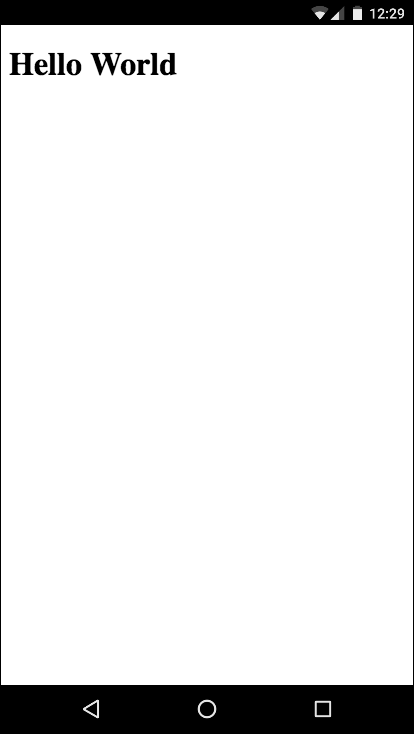
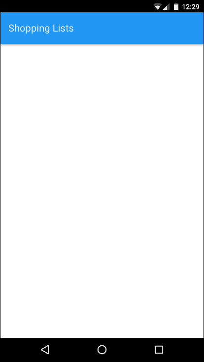
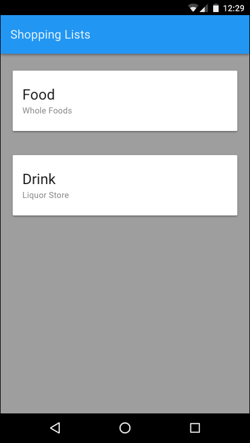
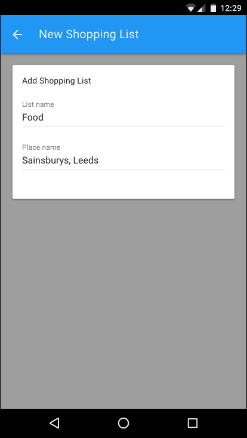
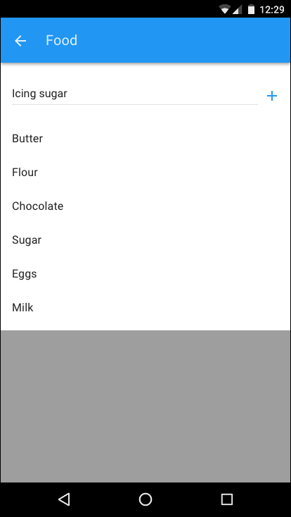
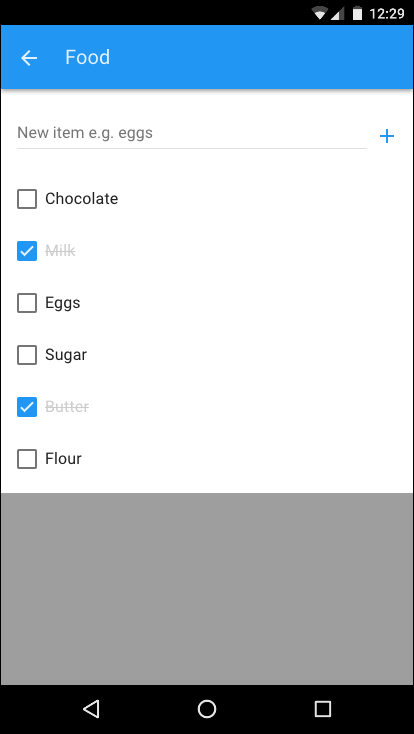

# Shopping List with Vue.js & PouchDB Tutorial

This document describes how to build your own Shopping List app with Vue.js and PouchDB in a step-by-step tutorial.

##  Prerequisite Knowledge & Skills

You will need to know how a web page is built, including HTML and CSS. A working knowledge of JavaScript is also essential.

This tutorial will guide you through the process of creating the app on your machine, so it is recommended you have a code editor (I use [Visual Studio Code](https://code.visualstudio.com/)) and a web server - I use Python's built-in server (see Inital Set Up).

You'll also need a modern web browser, such as Google Chrome. It helps to use the browser's Developer Tools so that you can debug your app as you develop it.

##  Key Concepts

The shopping list app is a very simple web app consisting of a single HTML file, a single CSS file and a single JavaScript file. The web page will allow multiple shopping lists to be created (Food, Drink, Pets etc) each with a number of shopping list items associated with them (Bread, Wine, Dog Food etc). 

The web page will be controlled by [Vue.js](https://vuejs.org/) which will be responsible for transferring user input to the JavaScript app and for rendering the app's data in HTML. 

Later we will add *persistance* to the app by storing the shopping lists and items in an in-browser database [PouchDB](https://pouchdb.com/). This will allow your data to survive between sessions and allow the data to be synced to the cloud for safekeeping.

At the end of the tutorial we will have created a [Progressive Web App](https://developers.google.com/web/progressive-web-apps/), an enhanced website that can be "installed" on a mobile phone which can be used with or without an internet connection.

## Initial Set Up

First we need a new empty folder on your computer and three files that define our app:

- index.html - the HTML markup of our website
- shoppinglist.js - the "app" itself, storing the shopping list state and defining your application's logic
- shoppinglist.css - some CSS styling to customise our app's look

Create the three blank files in a new directory and we can start to build the application scaffolding.

We can leave our JavaScript and CSS files blank for now, but let's create a simple HTML file to start with:

```html
<!DOCTYPE html>
<html lang="en">
<head>
  <meta http-equiv="Content-Type" content="text/html; charset=UTF-8"/>
  <meta name="viewport" content="width=device-width, initial-scale=1, maximum-scale=1.0"/>
  <title>Shopping List</title>

  <!-- our styles -->
  <link href="shoppinglist.css" type="text/css" rel="stylesheet" media="screen,projection"/>
</head>
<body>
   
  <h1>Hello World</h1>
  <!-- our code -->
  <script src="shoppinglist.js"></script>

  </body>
</html>
```

This web page does nothing but pull in your JavaScript & CSS files and show a "Hello World" message. You can run a simple web server on your machine to view your web page. I use Python's built-in web server:

```sh
python -m SimpleHTTPServer 8001
```

Once running, you can visit http://localhost:8001 in your web browswer to see your "Hello World" web page. Try modifying the contents of the 'h1' tag in index.html and refreshing your web browser to see the changes.

Your code should now look like [Tutorial Step 1 - Initial Set Up](tutorial/step1).



## Creating the Vue.js App

Next we need to add the Vue.js to our project. Vue.js is a JavaScript library that controls the follow of data from your JavaScript application to the HTML page, and vice versa. 

First we'll need to include some extra styling information in the 'head' section of your index.html, before the line that includes your CSS file:

```html
  <!-- Material Design icons and fonts  -->
  <link rel="stylesheet" href="//fonts.googleapis.com/css?family=Roboto:300,400,500,700,400italic">
  <link rel="stylesheet" href="//fonts.googleapis.com/icon?family=Material+Icons">

  <!-- Material Design styles for Vue.js  -->
  <link rel="stylesheet" href="https://unpkg.com/vue-material@0.7.4/dist/vue-material.css">
```

These are the fonts and styles required to turn a plain HTML app into one that adheres to the [Material Design Guidelines](https://material.io/guidelines/) - the design framework Google uses in its products. We are using a library called [Vue Material](http://vuematerial.io/) which contains a number of HTML components that are Vue.js compatible and conform to Material Design for very little effort on our part.

We also need some extra JavaScript objects at the bottom of our index.html file, just above the line that includes our shoppinglist.js file:

```html
 <!-- cuid - unique id generator -->
  <script src="https://cdnjs.cloudflare.com/ajax/libs/cuid/1.3.8/browser-cuid.min.js"></script>

  <!-- Vue.js - framework that handles DOM/Model interaction -->
  <script src="https://unpkg.com/vue@2.4.2/dist/vue.js"></script>

   <!-- vue-material - Material Design for Vue.js -->
   <script src="https://unpkg.com/vue-material@0.7.4/dist/vue-material.js"></script>
```

This is the Vue.js core code and the Vue Material plugin.

We can then replace our hard-coded 'h1' tag with a 'div' tag that will become our Vue.js app:

```html
  <div id="app" class="app-viewport">
    <!-- top bar -->
    <md-whiteframe md-elevation="3" class="main-toolbar">
      <md-toolbar>
        
        <!-- page title -->
        <h2 class="md-title" style="flex: 1">{{ pagetitle }}</h2>

      </md-toolbar>
    </md-whiteframe> <!-- top bar -->


  </div>
```

It contains the top bar for our app and a placeholder for where our page title will be. Because our page title will vary as users progress through the app, we use the `{{ pagetitle }}` template markup to indicate that this value will come from our JavaScript app at run-time.

Finally, our `shoppinglist.js` needs some content:

```js
// Vue Material plugin
Vue.use(VueMaterial);

// Vue Material theme
Vue.material.registerTheme('default', {
  primary: 'blue',
  accent: 'white',
  warn: 'red',
  background: 'grey'
});

// this is the Vue.js app
var app = new Vue({
  el: '#app',
  data: {
    pagetitle: 'Shopping Lists'
  }
});
```

The above code hands control of the div whose id is 'app' to the Vue.js framework. It now controls how that div is updated. The `data` object in the Vue object is our app's *state*. Currently, it only holds the page title and the HTML template renders that page title on the top bar of the page. 

> Try altering the page title in your Developer Tools console. Type `app.pagetitle='Hello'` and your page title should update instantly. Vue.js is detecting that your app's state has changed and updates the HTML to reflect that. 

Your code should now look like [Tutorial Step 2 - Creating the Vue.js App](tutorial/step2) and in a web browser should be beginning to look like an app with a blue bar at the top.



## Adding data

Our app is going to store two types of data

- a collection of shoppping lists. Each shopping list has a name (e.g. Food) and an optional place (e.g. Walmart).
- collection of items that are paired with a single shopping list (e.g. Bread in the Food list)

Here's what a shopping list object, repsresented as JSON, would look like:

```js
{
  "_id": "list:cj6mj1zfj000001n1ugjfkj33",
  "type": "list",
  "version": 1,
  "title": "Groceries",
  "checked": false,
  "place": {
    "title": "Healthy Living"
  },
  "createdAt": "2017-08-21T18:40:00.000Z",
  "updatedAt": "2017-08-21T18:40:00.000Z"
}
```

Notice that `_id` of the document consists of the data type (list) and a unique identifier. We also represent the data type in the 'type' field and the other fields are self-explantory.

A shopping list item, is even simpler:

```js
{
  "_id": "item:cj6mn7e36000001p9n14fgk6s",
  "type": "item",
  "list": "list:cj6mj1zfj000001n1ugjfkj33",
  "version": 1,
  "title": "Mangos",
  "checked": false,
  "createdAt": "2017-08-21T18:43:00.000Z",
  "updatedAt": "2017-08-21T18:43:00.000Z"
}
```

It contains a reference to the id of list in which it belongs.

If we want to store a collection of shopping lists and a collection of items in our Vue.js app, all we need to do is add two arrays to the `data` object in our app:

```js
// this is the Vue.js app
var app = new Vue({
  el: '#app',
  data: {
    pagetitle: 'Shopping Lists',
    shoppingLists: [],
    shoppingListItems: []
  }
});
```

It's that simple. Next, in index.html, we want to render the `shoppingLists` array. This is acheived by with two components:

- the [md-list tag](http://vuematerial.io/#/components/list) from the Vue Material library to render a Material Design list item
- the [v-for directive](https://vuejs.org/v2/guide/list.html) from the Vue.js library to iterate over each item in the `shoppingLists` array
- the [v-bind directive](https://vuejs.org/v2/guide/class-and-style.html) (represented here as `:key` and `:data-id`) to add attributes to HTML tags from our shoppingList object
- [curly bracket template syntax](https://vuejs.org/v2/guide/syntax.html) to surface data from our shoppingList object on the page

Place this code below your top bar in the index.html file:

```html
      <!-- list of shopping lists -->
      <md-list>
        <md-card v-for="list in shoppingLists" :key="list._id" :data-id="list._id">     
          <md-card-header>
            <div class="md-title">{{ list.title }}</div>
            <div class="md-subhead">{{ list.place.title }}</div>
          </md-card-header>
        </md-card>
      </md-list> <!-- list of shopping lists -->
```

You still won't see any data on your web page because the `shoppingList` array is empty. Let's simulate the addition of a new shopping list be running a command on the browser's Developer Tools console:

```js
var obj = {_id:'list:1',type:'list',version:1,title:'Food',checked:false,place:{title:'Whole Foods'},createdAt: '', updatedAt:''}
app.shoppingLists.push(obj);
```

Let's tidy up the styling, by adding the following to your shoppinglist.css file:

```css
body {
  background-color: #9e9e9e
}

.md-theme-default.md-card {
  background-color: white !important;
  margin:20px
}
```

Your code should now look like [Tutorial Step 3 - IAdding data](tutorial/step3) and in a web browser should show any lists you manually push into the app's `shoppingList` array:



## Adding a shopping list

To be able to add a shopping list via our app, we need

- a button that takes to a "add shopping list" page
- a form to collect the title and place name of the shopping list
- some logic in our app to collect the form data and add it to the `shoppingList` array

First of all, we need to flip between "pages" in our app. This is a single page web app (so only one index.html file) so the concept of a page switch is something of an optical illusion. We simply flip the page title to "New Shopping List", add a back button to get back to the first page and stop displaying the list of shopping lists when we are in `addlist` mode.

Let's add a `mode` to the data object in our app and set it to `showlist` at startup:

```js
var app = new Vue({
  el: '#app',
  data: {
    pagetitle: 'Shopping Lists',
    shoppingLists: [],
    shoppingListItems: [],
    mode: 'showlist'
  }
});
```

and add `v-if` in our `index.html` to ensure that the list of shopping lists is only shown in `showlist` mode:

```html
    <!-- list of shopping lists -->
    <md-list v-if="mode == 'showlist'">
```

We can then add a floating button to our `index.html` which is clicked when the user wants to add a new shopping list. Add this code as the last item of your "app" div:

```html
      <!-- floating 'add shopping list' button -->
      <div class="floatingbutton" v-if="mode == 'showlist'">
        <md-button class="md-fab md-primary md-raised" v-on:click="onClickAddShoppingList">
          <md-icon>add</md-icon>
        </md-button>
      </div> <!-- floating 'add shopping list' button -->
```

The above button expects a `onClickAddShoppingList` function to exist on your app, so let's add that as a 'method' to our Vue.js app:

```js
var app = new Vue({
  el: '#app',
  data: {
    pagetitle: 'Shopping Lists',
    shoppingLists: [],
    shoppingListItems: [],
    mode: 'showlist'
  },
  methods: {
    onClickAddShoppingList: function() {

      // open shopping list form
      this.pagetitle = 'New Shopping List';
      this.mode='addlist';
    }
  }
});
```

and some new CSS:

```css
.floatingbutton {
  position: fixed;
  bottom: 5px;
  right: 5px;
  z-index: 1000;
}
```

We can test that now. Your app should have a blue '+' button in the bottom right, which when clicked enters 'addlist' mode. But we have no means of getting back! Let's fix that by adding a back button as the first thing in our 'md-toolbar' markup in `index.html`:

```html
        <!-- back button -->
        <md-button class="md-icon-button" v-if="mode != 'showlist'" v-on:click="onBack">
            <md-icon>arrow_back</md-icon>
        </md-button>
```

The button is programmed to only appear when not in 'showlist' mode, but we need to add its handler function `onBack` to the Vue.js app's `methods` object:

```js
    // when someone clicks 'back', restore the home screen
    onBack: function() {
      this.mode='showlist';
      this.pagetitle='Shopping Lists';
    }
```

Your web app should now allow you to navigate between your two screens. 

Let's add a new object to our Vue.js app to represent new shopping list:

```js
  .
  .
  data: {
    pagetitle: 'Shopping Lists',
    shoppingLists: [],
    shoppingListItems: [],
    mode: 'showlist',
    singleList: null
  }
  .
  .

```

and a global constant that represents the structure of a shopping list object:

```js
const sampleShoppingList = {
  "_id": "",
  "type": "list",
  "version": 1,
  "title": "",
  "checked": false,
  "place": {
    "title": "",
    "license": null,
    "lat": null,
    "lon": null,
    "address": {}
  },
  "createdAt": "",
  "updatedAt": ""
};
```

which we can use to populate `singleList` when the `onClickAddShoppingList` function is called:

```js

    onClickAddShoppingList: function() {

      // open shopping list form
      this.pagetitle = 'New Shopping List';
      this.mode='addlist';
      this.singleList = Vue.util.extend({}, sampleShoppingList);
      this.singleList._id = 'list:' + cuid();
      this.singleList.createdAt = new Date().toISOString();
    }
```

Now we need to display a form when in 'addlist' mode. Add the following markup to your index.html:

```html
     <!-- add new shopping list form-->
      <md-card v-if="mode == 'addlist'">
        <md-card-header>Add Shopping List</md-card-header>
        <md-card-content>
          <md-input-container>
            <label>List name</label>
            <md-input placeholder="e.g. Food" v-model="singleList.title"></md-input>
          </md-input-container>   
          
          <md-input-container>
            <label>Place name</label>
            <md-input placeholder="e.g. Whole Foods, Reno" v-model="singleList.place.title"></md-input>            
          </md-input-container>   

        </md-card-content>
      </md-card> <!-- add new shopping list form -->
```

Try out your app. When you click the "+" button, you should see a form. Fill in the values and inspect `app.singleList` in your developer tools console to see the values you have typed. This is Vue.js magic working in reverse: moving data from the web page in your your JavaScript app seamlessly.

Your code should now look like [Tutorial Step 4 - Adding a shopping list](tutorial/step4):



Next we need to add a way to save the list!

## Storing the new shopping list

Saving the shopping list is very simple. We just need to add the `singleList` object to the start of our `shoppingLists` array in our Vue.js app. First we need a button that indicates the user wants to save the list (rather than press "back" and cancel the operatio). For this we need a button in our `md-toolbar` tag that only displays in `addlist` mode:

```html
        <!-- save new shopping list button -->
        <md-button class="md-icon-button" v-if="mode == 'addlist'" v-on:click="onClickSaveShoppingList" v-bind:disabled="singleList.title.length == 0">
          <md-icon>check</md-icon>
        </md-button>
```

This button remains disabled until the length of the `singleList.title` is greater than zero, so we can't save a list without a title. We also need to add a `onClickSaveShoppingList` to our Vue.js app methods to handle the form submission:

```js
    onClickSaveShoppingList: function() {
      this.singleList.updatedAt = new Date().toISOString();
      this.shoppingLists.unshift(this.singleList);
      this.onBack();
    }
```

Your app should now save and display any number of shopping lists!

Let's go one stage further and add a button to show and edit the items on a list. First we need a new Vue.js data item to store the id of the list being viewed (currentListId) and a variable to store the new item title (newItemTitle):

```js
  data: {
    pagetitle: 'Shopping Lists',
    shoppingLists: [],
    shoppingListItems: [],
    mode: 'showlist',
    singleList: null,
    currentListId: null,
    newItemTitle:''
  }
```

Inside the `md-card` markup, we can add a new final section that displays a button against each shopping list card:

```html
          <md-card-actions>
            <md-button v-on:click="onClickList(list._id, list.title)">
                <md-icon>chevron_right</md-icon>
            </md-button>
          </md-card-actions>
```

When the button is clicked, it calls `onClickList` button, passing it the id of the list and its name. Let's add a Vue.js method to handle that event:

```js
    // the user wants to see the contents of a shopping list
    // we load it and switch views
    onClickList: function(id, title) {
      this.currentListId = id;
      this.pagetitle = title;
      this.mode = 'itemedit';
    }
```

This sets the `currentListId`, changes the page title and switches the app's mode to `itemedit`. Let's add some new markup that is rendered when we are in `itemedit` mode:

```html
      <!-- shopping list item editor -->
      <md-list class="itemedit" v-if="mode == 'itemedit'">
        <md-list-item>
          <md-input-container>
            <md-input v-model="newItemTitle" placeholder="New item e.g. eggs" @keyup.enter.native="onAddListItem"></md-input>
          </md-input-container>
          <md-button class="md-icon-button md-list-action" v-on:click="onAddListItem" v-bind:disabled="newItemTitle.length == 0">
            <md-icon class="md-primary">add</md-icon>
          </md-button>
        </md-list-item>
        <md-list-item v-for="item in shoppingListItems" :key="item._id" v-if="item.list == currentListId">
          <div class="md-list-text-container">
            {{ item.title }}
          </div>
        </md-list-item>
      </md-list> <!-- shopping list item editor -->
```

This consists of:

- a form at the top to allow new list items to be added
- an 'add' button
- a list of shopping list items

Notice how the `md-list-item` doesn't display ALL the list items, only the ones that belong to the `currentListId`. Also see how the `onAddListItem` function can be called by pressing the enter key on the input control, or by clicking add button. 

We need a new object template for a list item:

```js
const sampleListItem = {
  "_id": "list:cj6mj1zfj000001n1ugjfkj33:item:cj6mn7e36000001p9n14fgk6s",
  "type": "item",
  "version": 1,
  "title": "",
  "checked": false,
  "createdAt": "",
  "updatedAt": ""
};
```

and an `onAddListItem` method on our Vue.js app:

```js 
    onAddListItem: function() {
      if (!this.newItemTitle) return;
      var obj = JSON.parse(JSON.stringify(sampleListItem));
      obj._id = 'item:' + cuid();
      obj.title = this.newItemTitle;
      obj.list = this.currentListId;
      obj.createdAt = new Date().toISOString();
      obj.updatedAt = new Date().toISOString();
      this.shoppingListItems.unshift(obj);
      this.newItemTitle = '';
    }
```

and finally, a tiny piece of CSS:

```css
.itemedit {
  background-color: white !important
}
```

Now your app should allow multiple lists to be defined, each with their own separate list items.

Your code should now look like [Tutorial Step 5 - Storing the new shopping list](tutorial/step5):



Now let's deal with checking items from the shopping list.

## Checking items

Check an item is a simple matter of setting the `checked` flag for a shopping list item. This is where Vue.js really helps. We can create HTML checkbox which is tied to the `checked` flag of each item in the shopping list and Vue.js will do the rest.

Put the following code in the `v-for` loop of the shopping list editor section of our index.html file:

```html
          <div>
            <md-checkbox v-model="item.checked" class="md-primary"></md-checkbox>
          </div>
```

and we're going to add a CSS class called "cardchecked" to every item that has been checked, by adding some extra markup around our rendering of the `item.title`: 

```html
            <span v-bind:class="{ cardchecked: item.checked}">{{ item.title }}</span>
```

Finally, adding some extra CSS:

```css
.cardchecked {
  text-decoration: line-through;
  color: #ccc
}
```

That's it! You should now be able to check items from your shopping lists. Check items should appear grey and crossed out.

Your code should now look like [Tutorial Step 6 - checking items](tutorial/step5):



Now we need to add a database to permenantly store the data between sessions. This is where PouchDB comes in.

## Adding a PouchDB database


## To do
|
|
|
v

First we'll need to include some extra JavaScript files in your index.html
* Adding a PouchDB Database
* Syncing Data
  * Configure a Database
     * Option 1: Apache CouchDB
     * Option 2: IBM Cloudant
     * Option 3: Cloudant Developer Edition
  * Configure Remote Database Credentials
  * Trigger Database Replication
* Adding Multi-User / Multi-Device Features with Hoodie
  * Installing Hoodie
  * Configuring Hoodie
  * Using the Hoodie Store API
  * Using Hoodie Account API
  * Testing Offline Sync
* Adding Gelocation Features
* What's next?
  * Other Features
  * Get Involved in the Offline First Community!
  * Further Reading and Resources